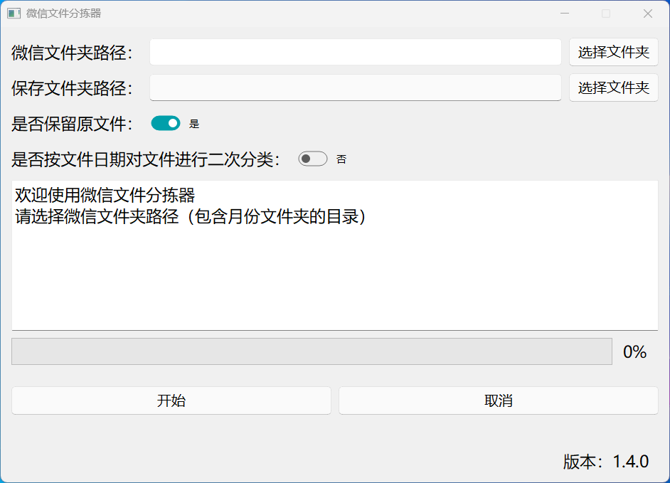
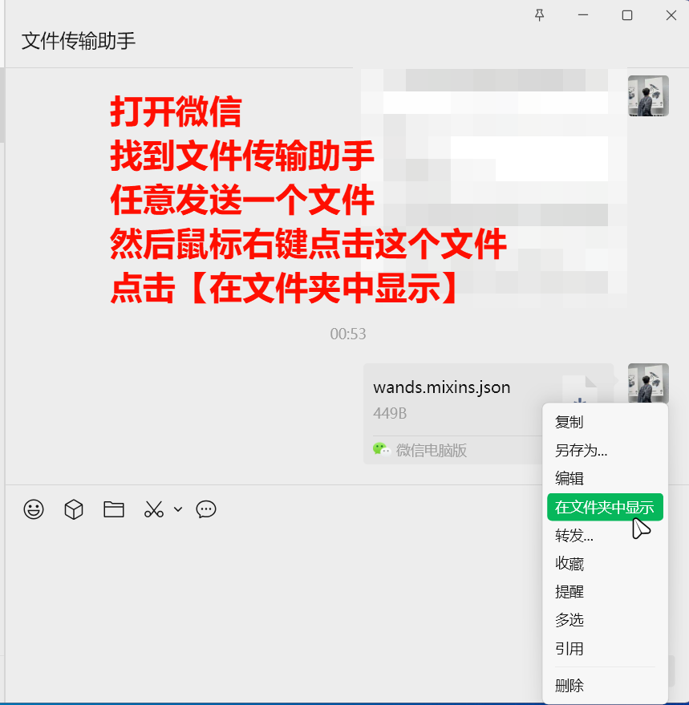
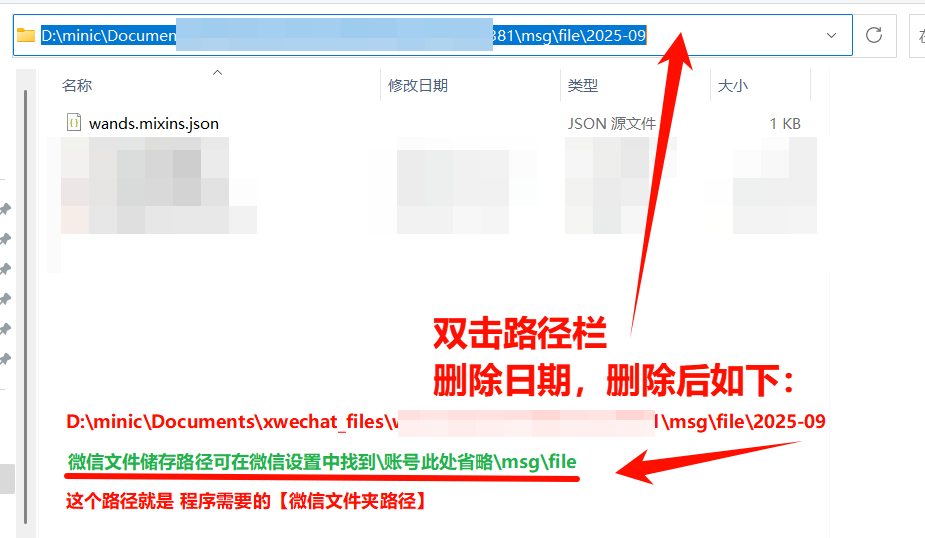

# 微信文件分拣器

一个用于整理微信PC端文件的工具，可以自动将微信月份文件夹中的文件按类型和日期进行分类整理。



## 功能特点

- 🚀 **多线程处理** - 快速处理大量文件
- 📁 **智能分类** - 按文件类型自动分类
- 📅 **日期分类** - 可选按文件修改日期进行二次分类
- 🔄 **灵活操作** - 支持复制或移动文件
- 🛡️ **重名处理** - 自动处理重名文件，避免覆盖
- 🎯 **图形界面** - 直观易用的PyQt5界面
- 💻 **命令行版本** - 提供命令行界面供高级用户使用

## 系统要求

- Windows 操作系统
- Python 3.8 或更高版本

## 安装依赖

```bash
pip install PyQt5 qfluentwidgets
```

## 使用方法

### GUI版本（推荐）

1. 运行 `main.py` 启动图形界面
2. 选择微信文件夹路径（包含月份文件夹的目录）如图：


3. 选择输出文件夹路径（可选，默认为程序所在目录）
4. 设置选项：
   - **是否保留原文件**：开启则复制文件，关闭则移动文件
   - **是否按文件日期二次分类**：开启则按YYYY-MM-DD格式创建日期子文件夹
5. 点击"开始"按钮开始处理

### 命令行版本

运行 `Multithreading.py`，按提示输入相应信息：

```bash
python Multithreading.py
```

## 文件组织结构

处理后的文件将按以下结构组织：

```
输出目录/
└── Files/
按文件日期二次分类
    ├── jpg/
    │   ├── 2024-01-15/
    │   │   ├── image1.jpg
    │   │   └── image2.jpg
    │   └── 2024-01-16/
    │       └── image3.jpg

不按文件日期二次分类
    ├── pdf/
    │   └── document1.pdf
    ├── mp4/
    │   └── video1.mp4
    └── no_ext/
        └── 无后缀文件
```

## 版本信息

- 当前版本：1.4.0
- 作者：友野

## 注意事项

1. 请确保选择的微信文件夹包含月份格式（YYYY-MM）的子文件夹
2. 处理大量文件时建议先备份重要数据
3. 程序会自动处理重名文件，在原文件名后添加数字标识
4. 无后缀名的文件将被归类到"no_ext"文件夹

## 故障排除

如果遇到问题，请检查：
- 微信文件夹路径是否正确
- 是否有足够的磁盘空间
- 文件权限是否足够

## 许可证

本项目仅供个人使用，请遵守相关软件使用协议。